# Pelican Cinema - System Diagrams (Mermaid)

## System Overview


## Signal Flow

```mermaid
flowchart TD
    A[🎮 HDMI Sources] --> B[HDMI Switch]
    B --> C[Audio Extractor]
    C --> D[7.1 PCM Audio]
    D --> E[Raspberry Pi 5]
    E --> F[Channel Separation]
    F --> G[ESP32 Master TX]
    G --> H{ESP-NOW Broadcast}
    
    H --> I1[Pod FL]
    H --> I2[Pod FR]
    H --> I3[Pod C]
    H --> I4[Pod SL]
    H --> I5[Pod SR]
    H --> I6[Pod RL]
    H --> I7[Pod RR]
    H --> I8[Pod SUB]
    
    subgraph Each Pod
        J[ESP32 RX] --> K[PCM5102A DAC]
        K --> L[TPA3116 Amp]
        L --> M[Speaker Driver]
    end
```



## Speaker Pod Internals

```mermaid
flowchart LR
    subgraph Wireless
        RX[ESP32-S3<br/>Receiver]
    end
    
    subgraph Audio
        DAC[PCM5102A<br/>DAC]
        AMP[TPA3116<br/>Class-D Amp]
        SPK[4" Full Range<br/>Driver]
    end
    
    subgraph Power
        BAT[3S LiFePO4<br/>9.6V 6Ah]
        BMS[Battery<br/>BMS]
        BUCK[5V Buck<br/>Converter]
    end
    
    RX -->|I2S| DAC
    DAC -->|Analog| AMP
    AMP -->|Power| SPK
    
    BAT --> BMS
    BMS -->|9.6V| AMP
    BMS --> BUCK
    BUCK -->|5V| RX
    BUCK -->|5V| DAC
```

## 7.1 Speaker Layout

```mermaid
flowchart TB
    subgraph Screen["🎬 Screen"]
        direction LR
        SCRN[" "]
    end
    
    subgraph Front["Front Speakers"]
        direction LR
        FL((FL))
        C((C))
        FR((FR))
    end
    
    subgraph Surround["Surround Speakers"]
        direction LR
        SL((SL))
        SR((SR))
    end
    
    subgraph Rear["Rear Speakers"]
        direction LR
        RL((RL))
        RR((RR))
    end
    
    subgraph Sub["Subwoofer"]
        SUB((SUB))
    end
    
    subgraph Listener["👤 Listening Position"]
        LP[" "]
    end
    
    SCRN ~~~ Front
    Front ~~~ Listener
    SL ~~~ LP
    SR ~~~ LP
    LP ~~~ Rear
    SUB ~~~ Front
```



## Phase Workflow

```mermaid
flowchart LR
    P1[Phase 1<br/>Wireless PoC<br/>$45] --> G1{Go?}
    G1 -->|Yes| P2[Phase 2<br/>Multi-Ch Sync<br/>$55]
    P2 --> G2{Go?}
    G2 -->|Yes| P3[Phase 3<br/>Command Module<br/>$620]
    P3 --> G3{Go?}
    G3 -->|Yes| P4[Phase 4<br/>Prototype Pod<br/>$175]
    P4 --> G4{Go?}
    G4 -->|Yes| P5[Phase 5<br/>Production<br/>$1,360]
    P5 --> P6[Phase 6<br/>Case Integration<br/>$350]
    P6 --> P7[Phase 7<br/>Calibration<br/>$50]
    P7 --> DONE[🎉 Complete!]
    
    G1 -->|No| PIVOT1[Pivot/Redesign]
    G2 -->|No| PIVOT2[Pivot/Redesign]
    G3 -->|No| PIVOT3[Pivot/Redesign]
    G4 -->|No| PIVOT4[Iterate Design]
```



## Build Dependencies


## Data Flow Timing


